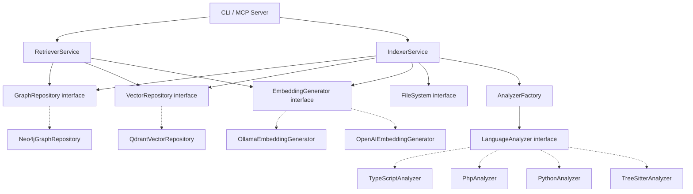
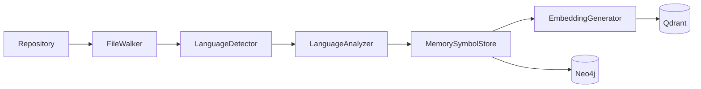

# Architecture

## Architectural Style

The project follows **Hexagonal Architecture (Ports & Adapters)** with **Domain-Driven Design** principles and **CQRS-lite** for the indexing (commands) vs retrieval (queries) separation.

```
┌────────────────────────────────────────────────────┐
│                 PRIMARY ADAPTERS                    │
│  MCP Server (stdio/HTTP+SSE/Streamable HTTP)  CLI (commander) │
└──────────────────────┬─────────────────────────────┘
                       │ depends on
┌──────────────────────▼─────────────────────────────┐
│               APPLICATION LAYER                     │
│  RetrieverService   IndexerService                 │
│  Ranker, Deduplicator, Compressor, TokenBudget     │
│  IncrementalIndexer, SymbolDiffer                  │
└──────────────────────┬─────────────────────────────┘
                       │ depends on (via interfaces)
┌──────────────────────▼─────────────────────────────┐
│                  DOMAIN LAYER                       │
│  Symbol, Relationship, SourceLocation              │
│  SymbolKind, RelationshipKind, Language            │
│  SymbolId, RepositoryName (value objects)          │
│  All port interfaces (contracts)                   │
└──────────────────────┬─────────────────────────────┘
                       │ implemented by
┌──────────────────────▼─────────────────────────────┐
│             INFRASTRUCTURE LAYER                    │
│  Neo4jGraphRepository    QdrantVectorRepository    │
│  OllamaEmbeddingGenerator  OpenAIEmbeddingGenerator│
│  LocalFileSystem  SimpleGitAdapter                 │
│  Tsyringe DI Container                             │
└────────────────────────────────────────────────────┘
```

## Layer Responsibilities

### Domain Layer (`@yats/shared`)

- **Entities/Value Objects:** `Symbol`, `Relationship`, `SourceLocation`, `SymbolId`
- **Enums:** `SymbolKind` (39 values), `RelationshipKind` (21 values), `Language` (4 values)
- **Ports (interfaces):** `GraphRepository`, `VectorRepository`, `EmbeddingGenerator`, `Indexer`, `Retriever`, `FileSystem`, `GitAdapter`, `LanguageAnalyzer`, `SymbolStore`
- **No dependencies on any other layer or external library**

### Application Layer (`@yats/indexing`, `@yats/retrieval`)

- **Orchestrates use cases:** indexing pipeline, hybrid retrieval pipeline
- **Depends on:** Domain interfaces (ports), never on infrastructure directly
- **Uses:** Dependency injection to receive implementations
- **Does NOT:** Access Neo4j, Qdrant, or filesystem directly

### Infrastructure Layer (`@yats/infra`)

- **Implements all port interfaces** defined in the domain
- **Neo4j:** Connection (retry logic), GraphRepository (CRUD + graph traversal)
- **Qdrant:** Connection (collection init), VectorRepository (upsert + search + filtered search)
- **Embeddings:** Ollama (768d nomic-embed-text), OpenAI (1536d text-embedding-3-small)
- **Storage:** LocalFileSystem (with path traversal protection), MemorySymbolStore
- **Git:** SimpleGitAdapter (wraps `git` CLI via `execSync`)
- **DI:** Tsyringe container with factory-based registration

### Adapters Layer

- **MCP Server** (`@yats/mcp-server`): Primary driving adapter. JSON-RPC over stdio, HTTP+SSE, and Streamable HTTP. 20 tools (including async `index_repository` and `delete_repository`).
- **CLI** (`@yats/cli`): Secondary driving adapter. Commander-based CLI with `list`, `index`, `search`, `serve`, `summary`, `clear`.
- **Bridge** (`packages/bridge`): Thin proxy that translates stdio MCP ↔ HTTP+SSE, for agents that only speak stdio.
- **Setup** (`packages/setup`): One-command wizard (`npx yats-setup`) that configures Docker, clones repos, and starts services.

### Analyzers (Plugin Layer)

- Each analyzer implements `LanguageAnalyzer` interface
- Produces `AnalysisResult { symbols, relationships, errors }`
- Can be registered via `AnalyzerFactory.register()`
- Use subprocess bridges when parser runs in a different runtime (.NET, PHP, Python)

## Dependency Flow



Solid lines = compile-time dependency on interface. Dotted lines = runtime implementation binding via DI.

## Indexing Pipeline



1. Walk filesystem (respects `.gitignore`, skips `node_modules`, `vendor`, etc.)
2. Detect language by extension + shebang
3. Dispatch to appropriate `LanguageAnalyzer`
4. Extract `Symbol[]` and `Relationship[]`
5. Store in in-memory `MemorySymbolStore`
6. Batch-generate embeddings
7. Batch-upsert to Neo4j (graph) and Qdrant (vectors)

## Retrieval Pipeline (Hybrid Search)

```mermaid
flowchart TD
    Query[Natural language query] --> Embed[Generate embedding]
    Embed --> Qdrant[Qdrant vector search]
    Qdrant --> VectorHits[Top-K vector hits]
    VectorHits --> Resolve[Resolve symbol IDs]
    Resolve --> Neo4j[Neo4j graph expansion]
    Neo4j --> GraphItems[Graph neighbors]
    VectorHits --> VectorItems[Vector items]
    GraphItems --> Merge[Merge]
    VectorItems --> Merge
    Merge --> Dedup[Deduplicate]
    Dedup --> Rank[Rank]
    Rank --> Compress[Compress]
    Compress --> Budget[Token budget check]
    Budget --> Result[RankedContextItem[]]
```

## Key Design Decisions

1. **Subprocess bridges for analyzers** — Roslyn (C#) runs on .NET, PHP-Parser runs on PHP, LibCST runs on Python. Node.js spawns these as subprocesses, passing files via CLI args, receiving JSON on stdout.

2. **Two databases, two purposes** — Neo4j for graph relationships (traversal, expansion), Qdrant for vector similarity search. The retriever combines both.

3. **Symbol ID format** — `{repository}::{relativePath}::{symbolPath}`. Guarantees global uniqueness. The `::` separator was chosen because it doesn't appear in file paths or symbol names.

4. **Content hashing for change detection** — Every symbol has a `contentHash` (SHA256 of `sourceSnippet`). The `SymbolDiffer` compares old vs new hashes to determine added/modified/deleted.

5. **Token budget in retriever, not LLM** — The `RetrieverService` uses `TokenBudgetService` (chars/3.5 heuristic) to fit results within a budget. The LLM never decides what to truncate.

6. **Convention-based architectural detection** — Analyzers detect Controller/Service/Repository/DTO/Entity by naming patterns and framework decorators (e.g., `@Controller()` in NestJS, `@app.get()` in FastAPI). No manual annotation needed.

## Communication Between Modules

All inter-module communication uses **interfaces defined in `@yats/shared`**. There is no direct coupling between packages.

- MCP Server → Retriever: via `Retriever` interface
- MCP Server → GraphRepository: via `GraphRepository` interface
- CLI → Indexer: via `Indexer` interface
- Analyzers → Indexer: via `LanguageAnalyzer` interface (returning `AnalysisResult`)

## Dependency Injection

Uses **tsyringe** with manual factory-based registration (no decorators on classes).

- **Singleton:** `Neo4jConnection`, `QdrantConnection`, `SimpleGitAdapter`
- **Factory:** `Neo4jGraphRepository`, `QdrantVectorRepository`, `OllamaEmbeddingGenerator`/`OpenAIEmbeddingGenerator` (switched by `EMBEDDING_PROVIDER` env var)
- **Transient:** `MemorySymbolStore` (new instance per indexing run)

All tokens are defined in `packages/infra/src/di/tokens.ts` as `Symbol.for(...)`.

[← Back to README](./README.md)
