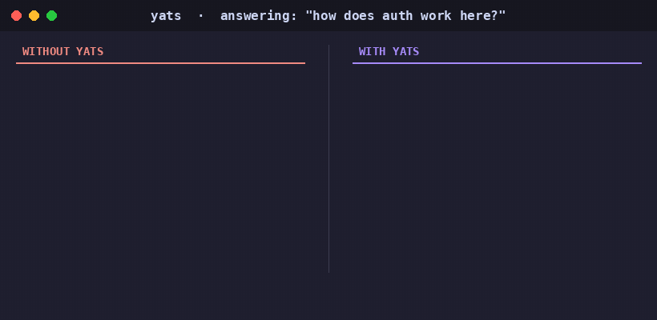
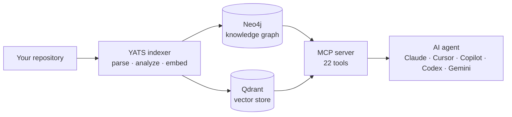

<div align="center">

<picture>
  <source media="(prefers-color-scheme: dark)" srcset="docs/images/logo-dark.svg">
  
</picture>

<h3>Stop paying your AI to re-read your own code.</h3>

<p>
  <a href="https://www.npmjs.com/package/yats-toolkit"></a>
  <a href="https://www.npmjs.com/package/yats-toolkit"></a>
  <a href="https://github.com/fvinciarelli/yats.ai"></a>
  <a href="LICENSE"></a>
</p>

</div>

---

**YATS** — *Yet Another Token Saver* — indexes your codebase into a **knowledge graph**. Your AI agent queries the graph instead of reading files one by one. Same answers, **37–73% fewer tokens** — on real repos, with a benchmark you can reproduce on your own code.

---

## The problem: you're paying your AI to read

Every time your agent needs to understand your code, it re-does the same brute-force ritual: grep for keywords, open file after file, guess how things connect. Not once — **every session, every question, for every developer, every day.**

That's not intelligence. That's a token bonfire. And it's the single biggest line item on your AI coding bill.

The cost isn't just "tokens". It's:

- 💸 **Budget** — your AI coding spend is 2–3× higher than it needs to be
- 🐢 **Time** — every "how does this work?" starts from zero and re-reads the same context
- 🎯 **Quality** — context windows are finite; agents see a *fragment* of your code and guess the rest

```
100,000 tokens to answer "how does auth work here?"
15 files read
0 understanding of relationships
```

## YATS gives your agent a map, not a pile of paper

We parse your entire codebase into a **knowledge graph**: every function, class, interface, and the relationships between them. When your agent needs an answer, it queries the graph — and reads the *5 relevant symbols*, not 15 files.



**The best part: you don't index manually.** When your agent connects to YATS and starts working in a directory, it checks if that project is indexed. If not, it indexes it *automatically*. No extra step. No remembering a command.

> You *can* index manually via `yats index ~/my-project`. But your agent handles it.

---

## Quick Start

```bash
npx yats-toolkit
```

The wizard asks which embedding provider to use (Ollama local + free, or OpenAI/Mistral/Voyage), which directories to pre-index, and writes your MCP config automatically.

**That's it. No other dependencies.** YATS pulls a Docker image with Neo4j, Qdrant, and the MCP server — everything runs in containers. No Python, no Java, no .NET SDK to install. Just Docker.

---

## Works with the agents you already use

| | Claude Code | Gemini CLI | Copilot CLI | Codex CLI | Cursor |
|---|---|---|---|---|---|
| Transport | stdio bridge | stdio bridge | stdio bridge | stdio bridge | HTTP |
| Setup | `yats connect --install` | `yats connect --install` | `yats connect --install` | `yats connect --install` | `yats connect --install` |

👉 Run **`yats connect`** from your repo — it installs your agent's config in one command without overwriting existing files (see [`connect/`](./connect/) for details). Each agent gets custom instructions that teach it to call `search_code` before `grep`, and to expand the graph instead of guessing relationships.

---

## 💰 What's your AI coding bill this month?

Most of the tokens your agent spends aren't writing code — they're **re-reading** it. YATS cuts the reading, not the thinking. On real repos, that's **37–73% fewer tokens** on code-understanding tasks (see [benchmarks](#dont-trust-us-reproduce-it-yourself) below).

*Illustrative math — a 40-dev team spending €2,000/month on AI coding tools:*

| Your monthly AI coding spend | Typical savings (~50%) | YATS license | You keep per year |
|---|---|---|---|
| €1,000/mo | €500/mo | €150/yr (25–74 devs) | **~€5,850/yr** |
| €2,000/mo | €1,000/mo | €350/yr (75–199 devs) | **~€11,650/yr** |
| €5,000/mo | €2,500/mo | €600/yr (200–499 devs) | **~€29,400/yr** |

> **TL;DR for your boss** *(copy-paste into the email asking for budget):*
>
> "Every time our AI coding tools need to understand our codebase, they read files one by one and burn tokens doing it. YATS indexes our code into a knowledge graph so agents query the graph instead — cutting token spend 37–73% on code tasks, measured by a benchmark we can reproduce on our own repos. It runs locally or with our own API keys, costs €150–600/year per team (free under 25 devs), and works with the agents we already use: Cursor, Claude, Copilot, Codex, and Gemini."

---

## Don't trust us. Reproduce it yourself.

Every benchmark we publish comes with the **full tooling to replicate it** — same questions, same repos, same methodology. No cherry-picking. No black boxes.

**And it works on your own code too.** Unlike benchmarks that only test popular open-source repos (which LLMs might already know from training), YATS lets you measure savings on *your* private projects — the code your agent actually works with every day.

```bash
yats benchmark
```

1. Pick your agent — Cursor, Claude, Copilot, Codex, or Gemini
2. Pick a language and repo — or point it at your own project
3. The wizard indexes it automatically
4. Your agent answers the same questions twice — with and without YATS
5. You get a side-by-side comparison: tokens, credits, cost

**Where your agent's keys come from** — `yats benchmark` runs *your* agent, which uses *your* credentials with its provider. The benchmark loads `~/.yats/.env` (written by `yats setup`, which pre-fills the agent key names) and any `.env` in the current directory or repo root; shell env vars take precedence.

| Agent | Credential |
|---|---|
| Gemini | `GEMINI_API_KEY` (free key: [aistudio.google.com/apikey](https://aistudio.google.com/apikey)) |
| Claude | `ANTHROPIC_API_KEY`, or your `claude` OAuth login |
| Codex | `OPENAI_API_KEY`, or your `codex` login (`~/.codex/auth.json`) |
| Copilot | your GitHub Copilot login (no env var) |
| Cursor | your `cursor-agent` login |

### Our results (that you can verify)

Same questions. Same repos. Fresh sessions. Every token counted.

| Agent | Repo indexed | Language | Without YATS | With YATS | You save |
|---|---|---|---|---|---|
| Codex | [hub-lab](https://github.com/fvinciarelli/hub-lab) (API backend) | Go | 100,000 tokens | 27,000 tokens | **73%** |
| Copilot | [hub-lab](https://github.com/fvinciarelli/hub-lab) (API backend) | Go | 1.19 credits | 0.40 credits | **66%** |
| Claude | [hub-lab](https://github.com/fvinciarelli/hub-lab) (API backend) | Go | 862k tokens · $0.21 | 541k tokens · $0.11 | **37%** tokens · **49%** cost |
| Gemini | Django (web framework) | Python | 115,122 tokens | 63,851 tokens | **45%** |

Run `yats benchmark` and get your own row in this table.

→ [Full benchmark suite and raw data](./packages/yats-toolkit/benchmark/)

---

## 🔒 Your keys, or none at all — and nothing leaves your machine

Indexing generates embeddings. You choose who runs that computation.

| | |
|---|---|
| 🆓 **Ollama — zero cost** | Runs locally on your machine. No API keys, no network calls, no bills. The `nomic-embed-text` model is pulled automatically. Indexing costs you nothing — ever. |
| 🔑 **Bring your own key** | Prefer a hosted model? Plug in your OpenAI, Mistral, or Voyage AI key. You pay your provider directly — YATS adds zero markup. |

Everything — Neo4j, Qdrant, the indexer, the MCP server — runs in **your own infrastructure**, in Docker. Your code never leaves your machine. That's the version of "AI tooling" your security team will actually sign off on.

---

## Your codebase, understood

Not grep. Not regex. Actual parsers that understand your code like an IDE does.

```
TypeScript → Compiler API (full AST)
C#         → Roslyn (.NET 8 bridge)
Python     → LibCST + Jedi
PHP        → nikic/php-parser
Go         → Native bridge
Everything → Tree-sitter fallback
```

Rust, Java, Kotlin, Ruby — more to come.

---

## Your agent, supercharged

Instead of reading 15 files, your agent calls:

| What the agent needs | Tool it calls |
|---|---|
| "How does auth work?" | `search_code("authentication flow")` |
| "Who calls this?" | `find_callers("PaymentService.process")` |
| "Show me the API" | `find_routes` |
| "Architecture overview?" | `architecture_summary` |
| "Where are the tests?" | `find_tests("UserService")` |
| "What's connected?" | `expand_graph(symbolId)` |

### All 22 tools

| Category | Tools |
|---|---|
| **Search** | `search_code`, `search_documentation`, `search_similar` |
| **Navigation** | `find_symbol`, `find_references`, `find_callers`, `find_callees` |
| **Inheritance** | `find_implementations`, `find_inheritors` |
| **Graph** | `expand_graph`, `related_symbols` |
| **Discovery** | `list_symbols`, `find_routes`, `find_configuration`, `find_tests` |
| **Repository** | `list_repositories`, `delete_repository` |
| **Analysis** | `repository_summary`, `architecture_summary` |

---

## Stays in sync while you work

YATS doesn't index once and go stale. When you or your agent edits a file, the index updates in seconds.

| | |
|---|---|
| 🔄 **Auto-reindex on query** | Every search checks if your repo changed since the last index. New commits? YATS incrementally re-indexes only what changed — before answering. |
| 📝 **Index a single file** | Call `index_file` and only that file gets re-analyzed, embedded, and stored. Under a second. |
| 🗑 **Remove on delete** | Call `remove_file` and its symbols disappear from the graph instantly. No dead references. |
| 👀 **Live watcher** | `yats watch ~/my-project` — every file change triggers an automatic re-index. |

---

## Architecture



- **Graph:** Neo4j 5 (symbols, calls, imports, inheritance — full relationship graph)
- **Vectors:** Qdrant (768d embeddings for semantic search)
- **Embeddings:** Ollama (local), OpenAI, Mistral, or Voyage AI
- **Protocol:** MCP JSON-RPC (stdio, HTTP+SSE, Streamable HTTP)
- **Deployment:** Single `docker compose up` — Neo4j + Qdrant + Ollama + YATS server

→ [Full architecture](./ARCHITECTURE.md)

---

## Simple pricing — one price per team

**Not per seat. One flat annual fee for your entire organization. Same product, same features at every tier.**

| Team size | Annual license | |
|---|---|---|
| < 25 developers | **Free** | |
| 25 – 74 developers | €150/year | [Buy license](https://buy.stripe.com/00w14m1SV52v1cmaTJ1Nu00) |
| 75 – 199 developers | €350/year | [Buy license](https://buy.stripe.com/14A14mcxz8eH4oy7Hx1Nu01) |
| 200 – 499 developers | €600/year | [Buy license](https://buy.stripe.com/3cIdR8aprbqT7AK9PF1Nu02) |
| 500+ developers | [Contact us](mailto:vinciarellifranco@gmail.com) | |

Annual subscription with auto-renewal. Cancel anytime. · [Full license terms](LICENSE)

---

## Requirements

- **Docker** with Compose plugin
- ~2GB disk (or ~3GB with Ollama local embeddings)
- Internet connection for first pull (fully local after that with Ollama)

---

## CLI reference

```bash
yats setup                        # One-time setup wizard
yats setup --provider openai --api-key sk-... --yes  # Non-interactive
yats index <path> [--skip-docs]  # Index a repository
yats search <query>               # Search indexed code
yats list                         # List indexed repositories
yats summary <repo>               # Show symbol/relationship counts
yats clear <repo>                 # Delete indexed data by name
yats remove <path>                # Delete indexed data by path
yats status                       # Check what's indexed and running
yats stop                         # Stop all services
yats start                        # Start services (after stop)
yats update                       # Update CLI to latest version
yats update-base                  # Update Docker images
yats connect [agent]              # Show agent setup config
yats connect --install <agent>    # Auto-place config files
yats bridge                       # MCP stdio ↔ HTTP proxy (for CLI-only agents)
yats benchmark                    # AI agent token comparison
yats watch <path>                 # Auto-reindex on file changes
```

---

## Links

- **npm:** [yats-toolkit](https://www.npmjs.com/package/yats-toolkit)
- **Website:** [fvinciarelli.github.io/yats.ai](https://fvinciarelli.github.io/yats.ai/)
- **Architecture:** [ARCHITECTURE.md](./ARCHITECTURE.md)
- **License:** [LICENSE](LICENSE)
- **Contact:** [vinciarellifranco@gmail.com](mailto:vinciarellifranco@gmail.com)
